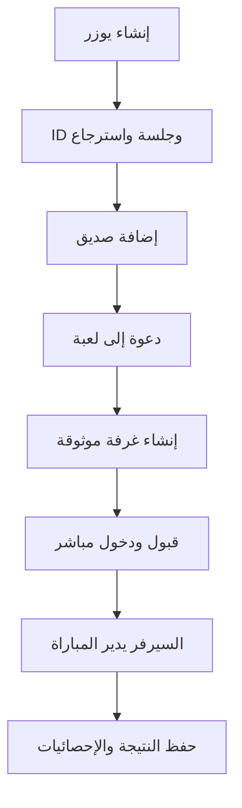

# تصميم بوسراج الاحترافي: الحسابات والأصدقاء وتطوير الثعبان والزهرة

**الحالة:** معتمد مبدئيًا، بانتظار مراجعة المواصفات المكتوبة  
**التاريخ:** 2026-08-31  
**النطاق:** منصة بوسراج الحالية المبنية على Cloudflare Workers وDurable Objects

## 1. الهدف

نقل بوسراج من منصة ألعاب تعمل تقنيًا إلى تجربة ألعاب عربية احترافية، مع الحفاظ على محركات اللعب الحالية والأونلاين الموثوق، وإضافة:

- حساب خفيف يعتمد على اسم مستخدم ومعرّف لاعب ثابت، بلا بريد في الإصدار الأول.
- نظام أصدقاء وطلبات ودعوات وحالة اتصال.
- واجهة رئيسية اجتماعية ومنظمة.
- إعادة تقديم السلم والثعبان والزهرة برسومات 2.5D وحركة وصوت بجودة ألعاب فعلية.
- بنية تسمح بربط البريد بالحساب نفسه لاحقًا من دون فقد الأصدقاء أو الإحصائيات.

## 2. القرارات المعتمدة

1. لا يُعاد بناء المشروع من الصفر؛ تبقى محركات القواعد والسيرفر الحالي أساسًا للعمل.
2. يضاف نظام الحسابات والأصدقاء كنظام مستقل، ولا يخلط بقواعد الألعاب.
3. اللعب المحلي يبقى متاحًا بلا حساب وبلا إنترنت.
4. دخول الغرف برمز الغرفة يبقى متاحًا للتوافق مع النسخة الحالية.
5. حساب اللاعب في الإصدار الأول لا يحتاج بريدًا أو كلمة مرور.
6. لا يسمح تسجيل الدخول باسم المستخدم وحده؛ لأنه غير آمن. ينشئ السيرفر رمز جلسة سريًا محفوظًا على الجهاز، مع رمز استرجاع خاص يعرض للاعب مرة واحدة.
7. ربط البريد لاحقًا يضيف وسيلة استرجاع للحساب الحالي ولا ينشئ حسابًا جديدًا.
8. لا توجد دردشة نصية مفتوحة في الإصدار الأول؛ تستخدم ردود وإيموجيات جاهزة لتقليل الإساءة والتعقيد.

## 3. ما لن يدخل في الإصدار الأول

- البريد وتسجيل الدخول عبر Google أو الجوال.
- متجر، عملات، مشتريات أو إعلانات.
- تصنيف عالمي أو نمط Ranked.
- دردشة نصية أو صوتية.
- رفع صور شخصية من الجهاز؛ تستخدم صور رمزية جاهزة.
- إعادة تصميم جاكارو وتحدي العباقرة بصريًا ضمن هذا الإصدار.

هذه العناصر تصلح لمراحل لاحقة بعد استقرار الحسابات والأصدقاء واللعبتين المستهدفتين.

## 4. هوية اللاعب والحساب الخفيف

### 4.1 إنشاء الحساب

عند أول تشغيل تظهر شاشة قصيرة تطلب:

- اسم مستخدم ظاهر وفريد: من 3 إلى 18 حرفًا، عربي أو إنجليزي أو أرقام أو شرطة سفلية.
- صورة رمزية من مجموعة جاهزة.
- لون اللاعب.

ينشئ السيرفر:

- `player_id`: معرّف داخلي غير قابل للتغيير.
- `player_code`: معرّف عام سهل المشاركة بصيغة مثل `BS-7K3M-P9Q2`، من أحرف وأرقام لا تتشابه بصريًا.
- `session_token`: سر جلسة يحفظ في IndexedDB على الجهاز ولا يظهر في الروابط.
- `recovery_key`: رمز استرجاع يعرض مرة واحدة، ويمكن نسخه أو تنزيله كصورة/نص.

اسم المستخدم هو نفسه الاسم الظاهر في الإصدار الأول. يمكن تغييره مع مهلة تمنع التبديل المتكرر، أما `player_code` فلا يتغير.

### 4.2 الاسترجاع وربط البريد لاحقًا

- قبل إضافة البريد، يسترجع الحساب من خلال `player_code + recovery_key`.
- يخزن السيرفر نسخة مشفرة/مجزأة من أسرار الجلسة والاسترجاع، ولا يخزنها كنص واضح.
- عند إضافة البريد مستقبلًا، يضاف سجل هوية جديد مرتبط بـ`player_id` نفسه.
- فقدان الجهاز ورمز الاسترجاع قبل ربط البريد يعني عدم إمكانية استرجاع الحساب؛ توضح الواجهة ذلك بوضوح.

### 4.3 الجلسات

- يمكن للحساب امتلاك أكثر من جلسة مستقبلًا، لكن الإصدار الأول يركز على الجهاز الأساسي والاسترجاع اليدوي.
- يمكن إلغاء كل الجلسات عند استخدام رمز الاسترجاع.
- كل طلب اجتماعي محمي بجلسة صالحة، مع تحديد معدل الطلبات.

## 5. نظام الأصدقاء

### 5.1 الوظائف

- البحث بالمعرّف العام الكامل، وليس بالاسم فقط.
- إرسال طلب صداقة وقبوله أو رفضه.
- إلغاء الصداقة.
- حظر لاعب وإلغاء الحظر.
- عرض الحالة: متصل، غير متصل، داخل مباراة، أو في لوبي.
- عرض اللعبة الحالية فقط إذا لم يكن اللاعب مخفيًا حالته.
- إرسال دعوة مباشرة إلى لعبة محددة.
- قبول الدعوة يفتح اللعبة وينضم إلى الغرفة المناسبة تلقائيًا.

### 5.2 الدعوات

تحتوي الدعوة على:

- المرسل والمستلم.
- نوع اللعبة.
- رمز الغرفة.
- وقت الإنشاء والانتهاء.
- الحالة: معلقة، مقبولة، مرفوضة، منتهية أو ملغاة.

مدة الدعوة الافتراضية خمس دقائق. لا تسمح الدعوة المنتهية بالانضمام التلقائي، وتعرض زرًا لطلب دعوة جديدة.

### 5.3 الخصوصية والسلامة

- خيارات الحالة: ظاهر، للأصدقاء فقط، مخفي.
- لا يمكن للاعب المحظور إرسال طلب أو دعوة.
- لا تعرض الواجهة أسرار الجلسة أو الاسترجاع لأي لاعب آخر.
- أسماء المستخدمين تمر بتنظيف والتحقق في السيرفر والواجهة.
- توجد حدود لمحاولات إنشاء الحسابات والبحث والطلبات والدعوات.

## 6. الصالة الرئيسية الجديدة

تتحول الصفحة الرئيسية من قائمة بطاقات ثابتة إلى صالة ألعاب اجتماعية:

- شريط علوي: الصورة الرمزية، اسم اللاعب، المعرّف، الإعدادات والإشعارات.
- منطقة «العب الآن»: بطاقات الألعاب مع المحلي والأونلاين.
- شريط الأصدقاء: المتصلون أولًا مع زر دعوة سريع.
- صندوق الطلبات والدعوات غير المقروءة.
- آخر المباريات والإحصائيات المختصرة.
- زر واضح لإنشاء حساب للاعب الضيف، من دون إجباره قبل اللعب المحلي.

على الجوال تفتح قائمة الأصدقاء كلوحة سفلية، وعلى الشاشات الكبيرة تظهر كلوحة جانبية قابلة للطي.

## 7. اتجاه الرسومات

### 7.1 النظام البصري المشترك

- الهوية: **Arcade عربية فاخرة**.
- الألوان: كحلي عميق، بنفسجي، ذهبي، ولمسات سماوية.
- استخدام زخارف هندسية عربية بخفة، من دون ازدحام أو تقليل وضوح اللعب.
- الخطوط والنصوص في DOM لسهولة القراءة والوصول.
- ساحة اللعب في Phaser 2D، بينما تبقى القوائم والـHUD في DOM.
- كل نتيجة نرد وحركة تأتي من محرك اللعبة أو السيرفر؛ الرسوم تعرض النتيجة ولا تقررها.
- تحميل أصول كل لعبة عند فتحها فقط، لا مع الصفحة الرئيسية.

### 7.2 السلم والثعبان

الثيم الأول: **وادي السراج السحري**.

- لوحة 2.5D بسطح حجري/خشبي وزخارف عربية خفيفة.
- ثعابين مرسومة كأصول فعلية، لكل منها رأس وعينان ولسان وحركة تنفس ونظرة نحو الحجر القريب.
- سلالم بمواد واضحة ولمعان قصير عند التفعيل.
- حركة الحجر تمر على الخانات بدل القفز الفوري.
- عند السلم: إضاءة صاعدة، أثر ذهبي، حركة كاميرا خفيفة وصوت صعود.
- عند الثعبان: التفاف الرأس، أثر هبوط، اهتزاز محدود وصوت خاص.
- عند الرقم 6: نبضة ذهبية ورسالة «رمية إضافية».
- عند الفوز: انتقال إلى منصة 100، كأس، قصاصات احتفال وإحصائية الجولة.

لا تضاف ثيمات متعددة أو قدرات خاصة في الإصدار الأول؛ يبنى النظام بحيث يقبلها لاحقًا.

### 7.3 الزهرة

الثيم الأول: **مجلس الملوك**.

- لوحة مربعة من الخشب الداكن والرخام مع تطعيمات ذهبية.
- مسارات اللاعبين واضحة بالألوان، مع تباين صالح للشاشات الصغيرة.
- أحجار مجسمة بصريًا مع قاعدة وظل ولمعة، وليست دوائر أو إيموجيات.
- إضاءة اللاعب صاحب الدور حول زاويته وصورته.
- الحجر القانوني للحركة ينبض بهدوء، وتظهر معاينة المسار عند الضغط.
- عند الأكل: اصطدام قصير، شرارة، رجوع الحجر إلى البيت بمسار مرئي ورسالة واضحة.
- منطقة الأمان تحمل رمز درع واضحًا.
- دخول آخر حجر إلى النهاية يشغل احتفالًا خاصًا وملخص المباراة.

### 7.4 النرد والحركة والصوت

- نرد موحد عالي الجودة للعبتين، مع خامة عاجية ونقاط عميقة.
- التحريك لا يخفي القيمة التي قررها السيرفر ولا يسمح بإعادة الرمية من العميل.
- مؤثرات صوتية منفصلة للنرد، الحركة، السلم، الثعبان، الأكل، الفوز والدعوات.
- اهتزازات قصيرة عند الأجهزة الداعمة، مع إمكانية تعطيلها.
- احترام `prefers-reduced-motion` وإعداد داخل اللعبة لتقليل الحركة.

## 8. البنية التقنية

### 8.1 الحدود بين الأنظمة

- **Simulation:** محركات `snakes` و`ludo` الحالية تظل المصدر الوحيد لقواعد اللعب.
- **Authoritative online state:** تبقى Durable Objects مسؤولة عن الرميات والأدوار والحركات.
- **Renderer:** Phaser يعرض اللوحة والأصول والحركة، ولا يملك نتيجة اللعبة.
- **HUD and menus:** تبقى في DOM لضمان النص العربي والوصول والاستجابة.
- **Social API:** نظام مستقل للحسابات والأصدقاء والدعوات والإحصائيات.
- **Assets:** ملف manifest ثابت بمفاتيح منطقية بدل الاعتماد على أسماء الملفات مباشرة.

### 8.2 التخزين والخدمات

- Cloudflare D1: اللاعبون، الجلسات، طلبات الصداقة، الصداقات، الحظر، الدعوات ونتائج المباريات.
- Durable Objects الحالية: غرف اللعب وحالة المباراة.
- Social Presence Durable Object: اتصالات الحالة الفورية وبث الدعوات للأصدقاء المتصلين.
- IndexedDB: رمز الجلسة وإعدادات الجهاز ونسخة مؤقتة من الملف الشخصي.
- Service Worker: ملفات الصالة الأساسية، مع تحميل رسومات الألعاب الكبيرة عند الحاجة.

### 8.3 تدفق الاستخدام

### 8.4 واجهات API المقترحة

- `POST /api/players` إنشاء لاعب.
- `GET /api/players/me` قراءة الملف الشخصي.
- `PATCH /api/players/me` تعديل الاسم والصورة واللون والخصوصية.
- `POST /api/players/recover` استرجاع الحساب.
- `POST /api/players/sessions/revoke-all` إلغاء الجلسات.
- `GET /api/friends` الأصدقاء والطلبات.
- `POST /api/friend-requests` إرسال طلب.
- `POST /api/friend-requests/:id/accept` قبول.
- `POST /api/friend-requests/:id/reject` رفض.
- `DELETE /api/friends/:playerId` إلغاء الصداقة.
- `POST /api/blocks/:playerId` حظر.
- `DELETE /api/blocks/:playerId` إلغاء الحظر.
- `POST /api/game-invites` إنشاء غرفة ودعوة صديق.
- `POST /api/game-invites/:id/accept` قبول ودخول.
- `GET /api/social/ws` اتصال الحالة والدعوات الفورية.

تتبع الواجهات أخطاء موحدة برمز قابل للاختبار ورسالة عربية مناسبة للمستخدم.

## 9. نموذج البيانات المختصر

- `players`: الهوية الداخلية، المعرّف العام، اسم المستخدم وصيغته الموحّدة، الصورة، اللون، الخصوصية، أوقات الإنشاء وآخر ظهور.
- `player_sessions`: جلسات اللاعب، بصمة الرمز، آخر استخدام، الإلغاء.
- `player_recovery`: بصمة رمز الاسترجاع وإصداره.
- `friend_requests`: المرسل، المستلم، الحالة والوقت.
- `friendships`: زوج اللاعبين ووقت القبول.
- `blocks`: الحاظر والمحظور.
- `game_invites`: اللعبة، الغرفة، المرسل، المستلم، الحالة والانتهاء.
- `match_results`: نتائج مباريات الأونلاين فقط؛ اللعبة، الغرفة، المشاركون، الفائز، الوقت وبيانات مختصرة يكتبها السيرفر فقط.

إحصائيات اللعب المحلي تحفظ على الجهاز وتعرض بوضوح على أنها محلية وغير معتمدة في سجل الأونلاين؛ لأن العميل يستطيع تعديل بياناته المحلية.

تفرض قاعدة البيانات قيودًا تمنع تكرار الصداقة، وإرسال طلب للنفس، وتكرار المعرّف أو اسم المستخدم الموحّد.

## 10. حالات الخطأ وتجربة المستخدم

- انقطاع الإنترنت لا يمنع الألعاب المحلية.
- عند انقطاع النظام الاجتماعي تظهر حالة «غير متصل» مع إعادة محاولة تدريجية، من دون تعطيل الصفحة.
- إذا كان اسم المستخدم مستخدمًا، تقترح الواجهة بدائل قريبة.
- إذا انتهت الدعوة، تظهر بوضوح ولا تنقل اللاعب إلى غرفة غير صالحة.
- إذا امتلأت الغرفة أثناء قبول الدعوة، يحصل اللاعب على رسالة واضحة ويستطيع طلب دعوة جديدة.
- عند فقد الاتصال أثناء المباراة، تستخدم آلية الاسترجاع الحالية ومهلة العودة.
- إذا فقدت الجلسة، تعرض الواجهة الاسترجاع ولا تنشئ حسابًا جديدًا تلقائيًا.

## 11. الأمان

- لا ترسل أسرار الجلسة أو الاسترجاع في URL.
- تحفظ بصمات الأسرار في السيرفر، وتستخدم مقارنة آمنة.
- يتحقق السيرفر من كل طلب صداقة أو حظر أو دعوة.
- لا يثق السيرفر بنتائج المباريات القادمة من العميل؛ تكتب النتيجة من Durable Object بعد نهاية موثوقة.
- تستمر حماية Origin ومحددات المعدل الموجودة، وتضاف حدود خاصة للحسابات والبحث والدعوات.
- تبقى أوراق جاكارو ومعلومات الألعاب الحساسة محجوبة حسب اللاعب.
- تنظف كل النصوص قبل العرض، مع قائمة أسماء محجوزة وفحص كلمات مسيئة أساسي.

## 12. الأداء والوصول

- الهدف 60 إطارًا في الثانية على هواتف Android متوسطة حديثة، مع تخفيض تلقائي للمؤثرات عند البطء.
- لا تحمل الصفحة الرئيسية أصول الثعبان أو الزهرة.
- تضغط الصور إلى WebP/AVIF عند الملاءمة، وتستخدم sprite atlases للأصول المتحركة.
- كل أزرار اللمس لا تقل عن 44×44 بكسل.
- دعم الوضعين العمودي والأفقي، و`safe-area` للشاشات ذات النتوء.
- تباين واضح، وعدم الاعتماد على اللون وحده لتمييز اللاعب أو الخانة.
- دعم لوحة المفاتيح للقوائم الأساسية، ونصوص بديلة للحالة المهمة.

## 13. الاختبارات

### 13.1 اختبارات المنطق والخادم

- الحفاظ على نجاح الاختبارات الحالية وعددها 67.
- اختبارات إنشاء الحساب والجلسة والاسترجاع وتعارض الاسم والمعرّف.
- اختبارات طلبات الصداقة، التكرار، الحظر والتزامن.
- اختبارات انتهاء الدعوات وقبولها وامتلاء الغرفة.
- اختبارات تزوير الجلسة والنتيجة وتجاوز محددات المعدل.
- اختبارات ترحيل D1 وإعادة تشغيله على قاعدة فارغة.

### 13.2 اختبارات الواجهة واللعب

- اختبار تدفق إنشاء الحساب وإضافة صديق والدعوة من متصفحين منفصلين.
- لقطات مقارنة للثعبان والزهرة على الجوال وسطح المكتب.
- اختبار كل حدث بصري: سلم، ثعبان، ستة، أكل، أمان، دخول النهاية والفوز.
- اختبار تقليل الحركة، تعطيل الصوت، تغيير الاتجاه، وانقطاع الشبكة.
- قياس زمن التحميل ومعدل الإطارات وتسرب الذاكرة بعد عدة مباريات.

## 14. مراحل التنفيذ

### المرحلة 1: الأساس الاجتماعي

- ترحيلات قاعدة البيانات.
- الحساب الخفيف والجلسة والاسترجاع.
- الأصدقاء والحظر والحالة والدعوات.
- الصالة الرئيسية الجديدة وربط الدعوة بالغرف الحالية.

### المرحلة 2: بنية العرض والأصول

- إدخال Phaser كساحة عرض مع DOM HUD.
- manifest للأصول، التحميل الكسول، النرد والصوت المشترك.
- تنظيف واجهات الثعبان والزهرة المكررة وفصلها عن المحركات.

### المرحلة 3: السلم والثعبان الاحترافي

- ثيم وادي السراج، الأصول، الحركات، المؤثرات وحالات الفوز.
- ربط كامل بالمحرك المحلي والسيرفر الحالي.

### المرحلة 4: الزهرة الاحترافية

- ثيم مجلس الملوك، الأحجار، المسارات، الأكل، الأمان والنهاية.
- ربط كامل بالمحرك المحلي والسيرفر الحالي.

### المرحلة 5: التحقق والإطلاق

- اختبارات تلقائية وبصرية ومتعددة الأجهزة.
- تحسين الأداء والوصول.
- تحديث Service Worker ونسخة PWA.
- التحقق من أن سير رفع ZIP يحافظ على ربط D1 وDurable Objects وإعدادات Worker المطلوبة.

هذا المستند مواصفة مظلة للنظام كاملًا. تُنفذ كل مرحلة بخطة مستقلة واختبارات وبوابة تحقق قبل الانتقال إلى التالية، ويبدأ التنفيذ بالمرحلة الأولى بدل جمع الأنظمة كلها في تغيير واحد ضخم.

## 15. معايير القبول

يعد الإصدار مكتملًا عندما:

1. يستطيع لاعب جديد إنشاء يوزر والحصول على ID ورمز استرجاع.
2. يستطيع لاعبان إضافة بعضهما، رؤية الحالة، وإرسال دعوة مباشرة.
3. يؤدي قبول الدعوة إلى دخول الغرفة الصحيحة من الجوال وسطح المكتب.
4. يبقى اللعب المحلي متاحًا من دون حساب أو إنترنت.
5. لا يستطيع العميل تزوير الرمية أو الدور أو نتيجة المباراة أو إحصائياته.
6. تعرض لعبتا الثعبان والزهرة الأصول الجديدة والحركات المتفق عليها، مع وضوح كامل للدور والحركة القانونية.
7. تنجح الاختبارات الحالية والجديدة والتحقق الثابت وCloudflare dry-run.
8. يعمل الاسترجاع من جهاز جديد باستخدام المعرّف ورمز الاسترجاع، ثم يبطل الجلسات القديمة.
9. تتدهور المؤثرات بأمان على الأجهزة الضعيفة ويظل اللعب قابلًا للاستخدام.
10. لا تتضمن النسخة الأولى دردشة مفتوحة أو اقتصادًا أو متجرًا أو تصنيفًا عالميًا.

## 16. الملفات والوحدات المتوقعة

- `migrations/`: مخطط D1 وترحيلاته.
- `src/social/`: الحسابات والجلسات والأصدقاء والدعوات والحضور.
- `src/index.js`: توجيه API وربط الخدمات، مع إبقاء منطق الوحدات خارج الملف.
- `public/assets/js/social/`: عميل الحساب والأصدقاء والدعوات.
- `public/assets/js/renderers/`: عارض Phaser المشترك وعارضا الثعبان والزهرة.
- `public/assets/game-art/`: أصول منظمة حسب اللعبة والثيم.
- `public/assets/game-art/manifest.json`: مفاتيح الأصول وإصداراتها.
- `public/assets/css/social-hub.css`: الصالة والملف الشخصي والأصدقاء.
- `public/index.html`, `public/snakes.html`, `public/zahra.html`: دمج الواجهات الجديدة.
- `test/`: اختبارات الوحدات والتكامل والأمان والواجهات.

يحدد مخطط التنفيذ النهائي أسماء الملفات الدقيقة بعد مراجعة هذه المواصفات، مع تجنب إعادة هيكلة أجزاء لا تخدم النطاق المعتمد.
